# claude-config

[](https://github.com/jcdendrite/claude-config/actions/workflows/tests.yml)
[](./LICENSE)
[](https://claude.ai/claude-code)

**Status:** stable — actively maintained.

Portable [Claude Code](https://claude.ai/claude-code) global configuration: custom skills, PreToolUse hooks that gate `git commit` and PR-comment flows, and a custom statusline. Runs on any Unix-like system (Linux, macOS, WSL). Managed with [GNU Stow](https://www.gnu.org/software/stow/).

Install it to wire in a set of pre-built hooks that gate commits, pushes, and PR comments until explicit review steps are satisfied; a full contribution pipeline from `/plan-it` through `/respond-pr`; a roster of specialist reviewer agents auto-triggered from code review; and a three-tier private-project redaction system that blocks sensitive identifiers before they land in public commits. See [Philosophy](#philosophy) for the design rationale.

Maintained by [Cordova Strategy](https://cordovastrategy.com).

## Table of Contents

- [Philosophy](#philosophy)
- [Docs](#docs)
- [Quickstart](#quickstart)
- [Requirements](#requirements)
- [What this installs](#what-this-installs)
- [Configuration](#configuration)
  - [Worktree enforcement](#worktree-enforcement)
  - [Autonomous shipping](#autonomous-shipping)
  - [Permission-prompt tracking](#permission-prompt-tracking)
  - [Repo relocation](#repo-relocation)
  - [Private-project redaction](#private-project-redaction)
  - [Auto mode](#auto-mode)
  - [Output preferences](#output-preferences)
  - [Machine-specific overrides](#machine-specific-overrides)
- [Context management](#context-management)
- [Tests](#tests)
- [Acknowledgments](#acknowledgments)
- [License](#license)

## Philosophy

### Why this repo exists

Working across a variety of projects from very early stage to enterprise-level, I wanted to use a flexible but predictable setup for Claude Code to help me get through large chunks of work efficiently and cost-effectively: from security audits of vibe-coded codebases to building out standard features, adding testing infrastructure, and enforcing quality against industry-standard, best-practice checklists. I wanted to stop fixing the same errors that AI agents kept encountering and really focus my time on the nuanced technical challenges that need human judgment.

### How this repo is different from others

AI agents are powerful but probabilistic. They will frequently gaslight you, or more fairly put, they will confidently draw incorrect conclusions from prose (even top-class models). Simply stated, unsupervised AI is reliable for summarization but not synthesis. I wanted to add a layer of determinism on top of agents' inherently probabilistic judgment to enforce quality and prevent repetitive errors where I could. To achieve these goals, I added safeguards in this repo with *hooks* and *markers*.

I also wanted to encode industry-standard best practices in this repo. LLMs are trained on the corpus of the internet and are biased by the loudest and most common viewpoints. While the wisdom of the masses can often be directionally correct, it's best to defer to primary sources and scientific thinking, applying the rigor of research and adhering to evidence-based approaches. You'll see those perspectives represented in the content of the *skills* and *instructions* in this repo, with *references* to primary sources that converge on tried-and-true guidelines on how to design and write good software.

### How enforcement complements instructions

Claude Code without enforcement will claim code is done before tests pass, skip the review step when it judges a change "too small," write to the main worktree when a concurrent session is already staged there, and paste project codenames directly into commit messages and PR bodies. `claude-config` makes these mistakes structurally impossible rather than relying on prompt instructions.

A CLAUDE.md instruction says "you should run code-review before committing." A PreToolUse hook says "the commit is denied until code-review ran against this exact diff." This distinction is the core design choice: enforce at the tool-call boundary, not at the prompt layer, because prompt-layer instructions are advisory — the model can disregard them on any change it judges simple enough not to need review.

`claude-config` is a **workflow-enforcement layer** — hooks that gate what Claude can do until explicit review steps are satisfied. It wires in the `anthropics/claude-plugins-official` marketplace but ships official plugins disabled by default; stow users can enable any of them via `enabledPlugins` in their settings. It also disables a set of bundled Claude Code skills that overlap with its review pipeline or are one-time setup utilities (see [docs/skills.md — Bundled skills disabled by default](docs/skills.md#bundled-skills-disabled-by-default)); stow users can re-enable any of them via `skillOverrides` in `~/.claude/settings.local.json`. `claude-config` ships the enforcement harness; hand-rolled `~/.claude/` configs improvise the patterns `claude-config` systematizes: content-addressed review markers, specialist reviewer routing, and three-tier redaction.

## Docs

- [`docs/design-decisions.md`](docs/design-decisions.md) — the non-obvious choices in this repo (hook-enforced gates, content-addressed review markers, no shared skill partials, project-layer composition via prose-pointer + glob, reviewer persona roster operations, etc.) and the reasoning behind each.
- [`docs/case-studies.md`](docs/case-studies.md) — index of longer-form case studies: individual design decisions examined in depth with primary-source citations.
- [`docs/walkthrough.md`](docs/walkthrough.md) — one full contribution cycle: plan → plan-review → code → code-review → commit → ready-for-review → push → respond-pr, showing each hook firing in sequence.
- **Two `CLAUDE.md` files, plus path-scoped rules.** The repo-root [`CLAUDE.md`](CLAUDE.md) is contributor workflow for this repo (what GitHub renders by default). The stowed [`claude/.claude/CLAUDE.md`](claude/.claude/CLAUDE.md) is the global engineering instructions applied to every Claude Code session on the machine after `./install.sh`. Contributor-workflow instructions that only apply to specific file types live in [`.claude/rules/`](.claude/rules/) instead, Claude Code's native path-scoped rules directory — loaded automatically only when a matching file is opened, rather than every session. The stowed [`claude/.claude/rules/`](claude/.claude/rules/) is the same mechanism applied to the global surface — it installs to `~/.claude/rules/` and applies in every repo the user opens, not just this one.

### Notable patterns

The README below is organized by feature surface (hooks, skills, plugins, scripts). If you came looking for transferable ideas, these are the load-bearing ones:

- **Content-addressed review markers** — a marker's content is a hash of exactly the state that was reviewed (staged diff, plan set, or HEAD sha), and that content is the whole authorization: a re-staged line auto-invalidates the gate without timers or manual reset, while a review still covering the current state keeps counting even from a different session. The `<repo-hash>.<session-id>` filename is a write-side key only, so parallel sessions can't clobber each other's markers. See [`docs/hooks.md`](docs/hooks.md) (`require-code-review.sh`) and `docs/design-decisions.md` decision 2.
- **Compaction-aware marker re-injection** — `session-marker-dashboard.sh` matches `startup|clear|compact`, restoring active-bypass marker visibility after auto-compact fires. See [Context management](#context-management).
- **Read-before-dispatch routing gate** — `require-routing-read.sh` blocks subagent spawn during `/plan-review` until `ROUTING.md` is read; a PostToolUse companion records the read per session. See [`docs/hooks.md`](docs/hooks.md).
- **Self-consuming continuity files** — `/handoff`/`/brief` write to a durable `~/.claude/` directory, not `/tmp`, so they survive a reboot; a `PostToolUse` `Read` hook mechanically consumes the file the moment it's read directly (the same-session `/clear`-then-read path), while `resume-context.sh` covers the fresh-process path. Owner-only permissions come from `./install.sh` hardening `~/.claude` (and `~/.claude.json`) once at install time, not from a chmod recipe in each skill. See [`docs/hooks.md`](docs/hooks.md) (`consume-durable-continuity-file-on-read.sh`), [`docs/design-decisions.md`](docs/design-decisions.md), and [Context management](#context-management).
- **Post-crash session recovery** — `post-crash-sessions` cross-references Claude Code's own session registry, scheduled-task lock files, and the transcript corpus against last-boot time to find sessions an unclean shutdown orphaned, printing a `cd <cwd> && claude --resume <id>` for each recoverable one — no manual transcript-corpus spelunking required. See [`docs/scripts.md`](docs/scripts.md).
- **Project-layer composition by glob + Skill-tool dispatch** — `/plan-it`, `/plan-review`, `/code-review`, and `/test-conventions` glob for `.claude/skills/<parent>-<project>/SKILL.md` at runtime; consuming repos extend the base skill without forking. Description-based auto-trigger was empirically tested and rejected (it doesn't fire from inside a running skill). Add-on skills on the project side should set `disable-model-invocation: true` — the parent invokes them via the Skill tool, so their description doesn't need to be in the always-loaded skill-listing budget. See [docs/skills.md](docs/skills.md) and `docs/design-decisions.md` decision 8.
- **Three-tier redaction** — always-on tracker-ID regex, opt-in user-local blocklist, reviewer discipline for structural fingerprints. See [Private-project redaction](#private-project-redaction).

## Quickstart

```bash
git clone git@github.com:jcdendrite/claude-config.git ~/claude-config
cd ~/claude-config
./install.sh
```

This symlinks `claude/.claude/` into `$HOME/.claude/`.

## Requirements

- **Operating system:** Linux, macOS, or WSL2. Native Windows (PowerShell / cmd.exe) is not supported — every hook is a bash script and `install.sh` uses GNU `stow` with symlinks. If you're on Windows, install inside [WSL](https://learn.microsoft.com/en-us/windows/wsl/install) instead.
- **Shell:** `bash`. Hooks and `install.sh` use `#!/bin/bash`.
- **Tools:** `stow`, `git`, `gh`, `jq`, `sha256sum`, and the `claude` CLI. `install.sh` verifies they exist and exits early if any are missing.
- **Optional:** `pytest` for running the test suite (`pytest claude/.claude/`).

**macOS:** `sha256sum` ships in GNU `coreutils`. Install with `brew install coreutils`, then add the gnubin directory to PATH so the unprefixed name resolves: `export PATH="$(brew --prefix coreutils)/libexec/gnubin:$PATH"`.

**PATH setup for script wrappers:** The user-facing scripts are installed as wrappers under `~/.local/bin/`. That directory needs to be on your PATH:

- **bash / zsh (any platform):** `install.sh` adds `export PATH="$HOME/.local/bin:$PATH"` to `~/.bashrc` and `~/.zshrc` itself, idempotently, on every run. If either file is a symlink (e.g. into another dotfiles-management repo), `install.sh` won't write through it — it either finds a `.local`-suffixed companion file that rc file already sources and manages the PATH block there instead, or prints a warning telling you the exact line to add and where. Restart your shell (or `source ~/.zshrc` / `source ~/.bashrc`) after the first run.
- **fish (any platform):** not automated. Add once: `fish_add_path ~/.local/bin`

Verify: `command -v cleanup-merged-branches` should print the wrapper path.

**Existing users:** `git pull` does not materialize new wrappers automatically, nor does it apply the owner-only permissions on `~/.claude` and `~/.claude.json` — both happen only when `./install.sh` runs. Re-run it once after pulling. After re-stowing, run `git status` in the repo: if any file under `claude/.local/bin/` shows as modified, stow's `--adopt` flag adopted a same-named local file. Revert with `git checkout claude/.local/bin/<name>` and rename the conflicting local script.

## What this installs

```
claude/        # stow package — claude/.claude/ → ~/.claude/
plugins/       # marketplace plugins (see Plugins section below)
docs/          # design-decisions, walkthrough, hooks, skills, scripts, auto-mode, redaction
.github/       # workflows, dependabot
.claude/       # repo-local plans, settings, worktrees (gitignored)
```

### Workflow

The skills form a sequential pipeline that covers the full contribution lifecycle. Hooks enforce the transitions so steps cannot be skipped.

Linear pipeline: plan-it → plan-review → code → code-review → commit → ready-for-review → push → respond-pr; each transition gated by a require-\* hook.

```mermaid
flowchart LR
    A[/plan-it/] --> B[/plan-review/]
    B -->|"require-plan-review.sh\ngates ExitPlanMode + Write/Edit while plan exists"| EPM([ExitPlanMode / present to user])
    EPM --> C([Write code])
    C --> D[/code-review/]
    D -->|"require-code-review.sh\ngates git commit"| E([git commit])
    E --> F[/ready-for-review/]
    F -->|"require-ready-for-review.sh\ngates git push"| G([git push / PR open])
    G --> H([Review comments arrive])
    H --> I[/respond-pr/]
    I -->|"require-respond-pr.sh\ngates gh api comment reads/posts"| J([PR replies posted])

    K([Session start]) -->|"capture-session-id.sh\nwrites session-id for marker lookup"| D
    K --> F
```



**Skills in the pipeline:**

- **`/plan-it`** — produce the implementation plan.
- **`/plan-review`** — review the plan against domain checklists.
- **`/code-review`** — principal-engineer review with ripple-effect triage.
- **`/skill-review`** — behavioral-equivalence audit when a `SKILL.md` changes. **Hook-enforced.** See [docs/skills.md](docs/skills.md#project-scoped-plugins).
- **`/agent-review`** — same audit for agent files (`claude/.claude/agents/*.md` or `plugins/*/agents/*.md`). Dispatcher-invoked by `/code-review`; **not** hook-enforced. See [docs/skills.md — Skill architecture notes](docs/skills.md#skill-architecture-notes).
- **`/ready-for-review`** — final tests + cumulative-diff review before push.
- **`/pr-description`** — author a PR body to standard, or verify an existing one against branch state.
- **`/respond-pr`** — fetch and reply to all PR comments with `[Claude Code]` attribution.

**Hook transitions:**

| Hook | Gates | Cleared by |
|---|---|---|
| `require-plan-review.sh` | `Write`/`Edit`/`ExitPlanMode` while an uncommitted or modified plan file exists in `.claude/plans/` | `/plan-review` marker covering the current plan set |
| `require-code-review.sh` | `git commit` | `/code-review` run against current staged state |
| `require-skill-review.sh` | `git commit` when staged changes include a `SKILL.md` | structural validation + `/skill-review` behavioral-equivalence audit |
| `require-plugin-version-bump.sh` | `git commit` under a plugin dir without a version bump on the branch (see [Plugins](#plugins-marketplace)) | bump the plugin's `version` field |
| `deny-private-project-refs.sh` | `git commit`, `gh pr create`, `gh pr edit`, mutating `gh api` | Clean the flagged tracker ID or private-project name from the diff/PR body |
| `deny-pii-in-commits.sh` | `git commit` when PII/PHI is in the staged diff or commit message (opt-in), or a credential-shaped value is (always on) | Remove the flagged content; see [`docs/hooks.md`](docs/hooks.md) |
| `deny-data-file-reads.sh` | `Read` of a data-shaped file (opt-in) | No clear — inspect data files outside Claude |
| `deny-credential-bash-reads.sh` | `Bash` command referencing a credential-shaped path (SSH key, `.netrc`, cloud credential store, and similar) | No clear — no bypass valve; inspect/run the specific command outside Claude |
| `deny-credential-file-reads.sh` | `Read` of a credential-shaped path, including through a symlink | No clear — no bypass valve; inspect the file outside Claude |
| `deny-network-installs.sh` | `Bash` command that installs a named package (including `uv add`), uses `npx`/`bunx`/`uvx`/`pipx run`/`npm exec` with an explicit `-y`/`--yes`, uses `pnpm`/`yarn dlx` unconditionally, or hands fetched content to a shell/interpreter | No clear — no bypass valve; run the specific command outside Claude via the `!` shell escape |
| `redact-credential-values.sh` | — (PostToolUse `Bash`/`Read`/`WebFetch`/`Grep`/`Task`, informational) | Redacts a credential-shaped value in the tool result via `updatedToolOutput`; see [`docs/hooks.md`](docs/hooks.md) |
| `deny-reviewer-tree-mutation.sh` | `Bash`/`Write`/`Edit`/`MultiEdit` from a review-only agent (`ciso-reviewer`, `staff-*`, `Explore`, `Plan`) that would mutate the tree under review | No clear — copy the file to `/tmp` and mutate the copy there |
| `require-ready-for-review.sh` | `git push`, `gh pr ready`, `gh pr create` | `/ready-for-review` run since last commit |
| `require-respond-pr.sh` | `gh api` PR comment reads/posts | `/respond-pr` active bypass marker |
| `advance-past-commit-stall.sh` | — (Stop, `turn-gate`, opt-in) | Forces the turn to continue past a commit/push/PR-open permission question when autonomous shipping is active; see [Autonomous shipping](#autonomous-shipping) |
| `capture-session-id.sh` | — (SessionStart, no gate) | Writes session-id so marker filenames are per-session |
| `nudge-handoff-near-context-cap.sh` | — (UserPromptSubmit + Stop, advisory) | Injects a one-shot reminder near the context cap; see [`docs/handoff-nudge.md`](docs/handoff-nudge.md) |
| `nudge-error-mode-analysis.sh` | — (UserPromptSubmit, advisory, opt-in) | Injects a one-shot suggestion to run `/error-mode-analysis`; see [`docs/error-mode-nudge.md`](docs/error-mode-nudge.md) |
| `nudge-worktree-anchor.sh` | — (UserPromptSubmit, advisory) | Reports when the session is working from the main tree of a worktree-enforcing repo while a linked worktree exists |
| `check-branch-divergence.sh` | — (SessionStart, advisory) | Surfaces feature-branch divergence from `origin/<default>`; see [`docs/hooks.md`](docs/hooks.md) |
| `set-session-title-from-branch.sh` | — (SessionStart, advisory) | Sets the terminal tab title to `<repo>/<branch>` on feature branches; see [`docs/hooks.md`](docs/hooks.md) |
| `track-permission-prompts.sh` | — (Notification, `informational`, opt-in) | Appends a redacted permission-prompt event to a local log; see [Permission-prompt tracking](#permission-prompt-tracking) |

See [`docs/walkthrough.md`](docs/walkthrough.md) for a concrete example of one full contribution cycle with hooks firing. For full descriptions of all hooks, skills, scripts, and project-scoped plugins, see [`docs/hooks.md`](docs/hooks.md), [`docs/skills.md`](docs/skills.md), and [`docs/scripts.md`](docs/scripts.md).

### Statusline

```
Opus 4.7 [###-------] 32% • 5h:7% • 7d:24% • $1.24 • ~/MyCode/proj • (main)
```

`statusline-command.sh` renders model, context usage percentage, 5-hour and 7-day capacity used percentages (for subscription plans), session cost (for API-based plans), working directory, git branch, and a clickable link to the current branch's open PR (colored by review state) in the status bar. Configured in `settings.json` via the `statusline` key.

The account segment (email / plan) reads `${CLAUDE_CONFIG_DIR:-$HOME}/.claude.json`, so it follows whichever account the running session authenticated as. `CLAUDE_CONFIG_DIR` is a first-party Claude Code env var that relocates `~/.claude` paths (see the [`.claude` directory reference](https://code.claude.com/docs/en/claude-directory)) — any account-switching setup that sets it before launching Claude Code gets a matching statusline for free.

### Plugins (marketplace)

Skills that apply to one or a few private projects — not broadly to all sessions — live as marketplace plugins under `plugins/<name>/` rather than in `claude/.claude/skills/`. This keeps them out of the global skill catalog and lets them be installed only in the repos that need them.

This repo exposes a marketplace via `.claude-plugin/marketplace.json`. Each plugin lives under `plugins/<name>/` with a `.claude-plugin/plugin.json` manifest and skills under `plugins/<name>/skills/<name>/SKILL.md`.

**Current plugins:**

`./install.sh` registers the `claude-config` marketplace automatically, and — when run from within claude-config's own checkout — also installs, at project scope, whichever of this repo's own plugins its committed `.claude/settings.json` declares enabled. To register the marketplace manually (without running `install.sh`), run `claude plugin marketplace add <path-to-claude-config>`. Then install any of the plugins below at project scope in a consumer repo:

Marketplace registration and user-scope `enabledPlugins` install are also available standalone via `register-marketplace` — `install.sh` calls it once for its own profile, but a machine running multiple Claude Code config profiles (each pointed at its own config directory via `CLAUDE_CONFIG_DIR`) can re-run it per profile: `CLAUDE_CONFIG_DIR=<profile-dir> register-marketplace`. See [`docs/scripts.md`](docs/scripts.md) for the full description.

- **`lovable-cloud`** — Skills for Lovable Cloud projects: Project/Workspace Knowledge fields, edge-function auth model (ES256 gateway constraint, two-tier auth), and migration-sync workflow. `claude plugin install lovable-cloud@claude-config --scope project`
- **`skill-management`** — Authoring guardrails for SKILL.md files: a commit-time structural validator (catches frontmatter that would silently truncate from the harness's skill listing or fail strict-YAML parsing) plus a behavioral-equivalence audit via `/skill-review`. `claude plugin install skill-management@claude-config --scope project`

  **Plugin dependency:** the structural validator imports `pyyaml`. On first session in a consumer repo, the plugin's `SessionStart` hook provisions a persistent venv at `${CLAUDE_PLUGIN_DATA}/venv` and installs `pyyaml` into it; the commit-time hook prefers that venv's `python` and falls back to system `python3`. `./install.sh` does not install anything into the host Python — contributors who run the test suite set up a repo-local `.venv` per [Tests](#tests).

- **`claude-hook-review`** — Review playbook for `.claude/hooks/*.sh` and `settings.json` hook entries: event/matcher selection, path resolution, script skeleton, fail-open/fail-closed posture, dispatch drift, and the review checklist. `claude plugin install claude-hook-review@claude-config --scope project`
- **`plugin-semver`** — Semver and version-field discipline for Claude Code plugin changes: when to bump major/minor/patch, which fields must be kept in sync, and a commit-time hook (`require-plugin-version-bump.sh`) that blocks a plugin-directory change unless the plugin's version was raised on the branch. `claude plugin install plugin-semver@claude-config --scope project`
- **`npm-semver`** — Semver and version-field discipline for published npm packages: when to bump major/minor/patch against the package's declared public API, a reminder to propagate a bump to consuming repos, and a commit-time hook (`require-npm-version-bump.sh`) that blocks a non-private package's source change unless `package.json`'s version was raised on the branch. `claude plugin install npm-semver@claude-config --scope project`

### Agents

Two agent types ship in `claude/.claude/agents/`:

**Reviewer subagents** — eight stack-agnostic personas spawned by `/plan-review` and `/code-review` based on the **Item ownership** tables in those skills. Each runs in its own context with tools `Read`, `Grep`, `Glob`, `Bash`, `Write`; all write structured findings to `agent-reviews/<agent-name>-<epoch>-<slug>.md` when dispatched with `findings_path:` and return only a pointer line inline.

- **`ciso-reviewer`** — threat modeling, auth boundaries, privilege escalation, data exposure, defense in depth.
- **`staff-backend-engineer`** — API contracts, error handling, idempotency, retry semantics, service boundaries; AND application data-store schema design (relational + NoSQL): partition keys, GSI/LSI, document shape, single-table vs multi-table, index coverage for app queries.
- **`staff-frontend-engineer`** — components, state, data fetching, cache consistency, routing, forms, accessibility, Web Vitals, i18n, client-side analytics emission.
- **`staff-data-engineer`** — operational data infrastructure across all stores: migration pipeline impact, DDL execution shape, CDC / change-stream config, ETL/ELT pipelines, warehouse ingestion transport, schema-drift detection, catalog / lineage tracking.
- **`staff-analytics-engineer`** — warehouse-side modeling (fact/dim, SCD, partitioning, materialization), transformation correctness, source-schema review for ELT-readiness from a data-contract consumer perspective.
- **`staff-platform-engineer`** — CI/CD, IaC, shell, deployment ordering, secret provisioning; observability coverage, alerting, SLO impact, runbook linkage, load, cost; deploy-window ordering and lock-budget on migrations.
- **`staff-product-engineer`** — spec-to-user-problem fidelity, critical spec reading, telemetry semantics, adjacent-regression, backward compat, accessibility-as-spec-fidelity.
- **`staff-sdet`** — testability of the design, pyramid shape, edge cases, mock design, fixture realism, security-invariant coverage, production code that lacks tests.

Schema-change diffs nominally route three ways — `staff-backend-engineer` (designs), `staff-data-engineer` (operational / pipeline impact, DDL shape), `staff-analytics-engineer` (ELT-readiness). Trigger discipline in the skill bodies prevents three-persona fire on trivial additive changes. The decision criteria for adding, splitting, or excluding a persona — including why DBRE, data platform engineer, and data steward are deliberately not in the roster — are in [docs/design-decisions.md §3](docs/design-decisions.md#3-specialist-reviewer-roster-8-personas).

For guidance on extending, splitting, or spawning personas, see [design-decisions.md §9](docs/design-decisions.md#9-reviewer-persona-roster-operations).

**`skill-fidelity-reviewer`** — a reviewer spawned by `/ready-for-review` (not by the two dispatchers, so it is outside the specialist-roster count above). It checks whether the skills a branch's work invoked were actually executed or silently abbreviated: it reads each invoked skill's body fresh and compares it to the delivered diff, so the observer never shares the deviating session's reasoning. Tools `Read`, `Grep`, `Glob`, `Write` — no `Bash`, because its task is closed-form (it is handed the skill-invocation list, not raw transcripts). Like the specialist reviewers, it writes findings to `agent-reviews/<agent-name>-<epoch>-<slug>.md` under `findings_path:` and returns only a pointer line.

**`code-writer`** — a non-reviewer Sonnet agent that implements delegated code changes and self-reviews its own diff before returning, verifying it against the relevant `staff-*` reviewer angles so review-finding-class defects are caught in its own context rather than as a parent round-trip. Dispatched by the parent in place of `general-purpose` for code-writing; see `claude/.claude/CLAUDE.md` "Model Routing" and `docs/design-decisions.md` §11.

### Configuration files

- **`CLAUDE.md`** — baseline engineering instructions (judgment heuristics, working style, safety rules).
- **`.claude/rules/`** — path-scoped instructions, loaded automatically only when a matching file is opened; used here for skill/agent self-review discipline and per-file-type review-pipeline dispatch.
- **`claude/.claude/rules/`** — the stowed, user-scope sibling (installs to `~/.claude/rules/`); holds CI/infra and SQL/DDL conventions that apply across every repo the user opens, not just this one.
- **`settings.json`** — global settings wiring up the hooks, statusline, and a `permissions.deny` hard floor for `sudo` and secret-file reads (see [Auto mode](#auto-mode)). Configured with **opusplan** as the default model (cost-effective and [recommended by Anthropic](https://support.claude.com/en/articles/14552983-models-usage-and-limits-in-claude-code)). Session-only overrides (model, effortLevel) are intentionally not tracked — use the `ANTHROPIC_MODEL` and `CLAUDE_CODE_EFFORT_LEVEL` env vars, or `/effort max` mid-session.

### Scripts

Utility scripts in `claude/.claude/scripts/` (stowed to `~/.claude/scripts/`); user-facing ones are installed as wrappers under `~/.local/bin/`. For full descriptions of every script, see [`docs/scripts.md`](docs/scripts.md).

## Configuration

Configuration options spanning machine-local, project-local, and user-local settings. See [SECURITY.md](./SECURITY.md) for the threat model — what the hook system protects against and what it doesn't.

### Worktree enforcement

`require-worktree-for-git-writes.sh` denies non-read-only git operations (`commit`, `push`, `rebase`, `reset`, `merge`, `checkout`, etc.) unless the session runs inside a linked git worktree. Read-only commands (`status`, `log`, `diff`, `fetch`, `show`, `blame`, etc.) are always allowed. The hook is opt-in per repo (via a committed `.claude/worktree-required` sentinel) or per machine (via `~/.claude/worktree-required`).

The race it prevents: concurrent Claude Code sessions sharing a working tree can step on each other — one session's `git reset --hard`, `git stash`, or `git checkout` silently wipes another session's uncommitted edits. See [Claude Code issue #34327](https://github.com/anthropics/claude-code/issues/34327) for examples of this failure mode in the wild.

#### Activating enforcement on a repo

The sentinel coexists with any existing `.claude/` content — `mkdir -p` is a no-op if the directory is already there, and the sentinel is an inert marker file alongside whatever project-level plans, `settings.local.json`, or untracked worktree dirs the repo already holds.

```bash
cd path/to/your/repo

mkdir -p .claude
cat > .claude/worktree-required <<'EOF'
# Claude Code worktree enforcement marker.
# Presence of this file activates ~/.claude/hooks/require-worktree-for-git-writes.sh.
# See https://github.com/jcdendrite/claude-config for details.
EOF

grep -qxF '.claude/worktrees/' .gitignore 2>/dev/null || echo '.claude/worktrees/' >> .gitignore

git add .claude/worktree-required .gitignore
git commit -m "Activate Claude Code worktree enforcement"
```

#### Working inside a worktree

A [git worktree](https://git-scm.com/docs/git-worktree) is a linked working directory on a separate branch that shares the repo's `.git` object storage with the main clone. `git worktree add <path> -b <branch>` creates one; multiple worktrees of the same repo can have different branches checked out simultaneously, which is what lets concurrent Claude Code sessions stay isolated.

With enforcement active, start sessions for non-trivial work in a worktree instead of the main tree:

```bash
git worktree add .claude/worktrees/my-feature -b my-feature
cd .claude/worktrees/my-feature
# work happens here; git commit/push/etc. pass through the hook cleanly
```

The contributor `.venv` is gitignored and lives only in the main worktree root — linked worktrees never inherit it. See [Tests](#tests) for cross-worktree invocation.

Agents spawned with `isolation: worktree` create their own worktrees under `.claude/worktrees/` automatically — on a harness-generated branch name (`worktree-agent-<hash>`). That auto-naming is fine for ephemeral, non-PR work (parallel exploration, reviewer agents). For PR-bound work that needs a meaningful branch name, create the worktree yourself with `git worktree add .claude/worktrees/<slug> -b <slug>` first, then dispatch the agent into that path.

To opt out, delete `.claude/worktree-required`.

#### Activate for all your repos (machine-level)

`./install.sh` now offers this interactively on every run — the snippet below is the non-interactive/scripted alternative, not the only path.

If you work across many repos and want enforcement everywhere without adding a marker to each:

```bash
touch ~/.claude/worktree-required
```

This activates enforcement for every git repo on your machine. Any repo that already has a committed `.claude/worktree-required` is unaffected (it was already enforcing). To exempt a specific repo from machine-level enforcement:

```bash
mkdir -p .claude && touch .claude/worktree-optout
```

The opt-out only modulates the machine-level default — it cannot exempt a repo whose committed `.claude/worktree-required` travels with the source.

Machine-level enforcement produces an untracked `.claude/worktrees/` directory in *every* repo you open, not just ones you've configured — so pair it with a global git-excludes entry rather than relying on each repo's own (possibly absent) `.gitignore`. This is a permanent, machine-wide change (it applies to every repo you ever open, not just this one); to reverse it later, remove the appended line from the same file:

```bash
f=$(git config --path --get core.excludesFile || echo "${XDG_CONFIG_HOME:-$HOME/.config}/git/ignore")
mkdir -p "$(dirname "$f")"
grep -qxF '**/.claude/worktrees/' "$f" 2>/dev/null || echo '**/.claude/worktrees/' >> "$f"
```

Without this, a `git add -A` in a repo that never got the per-repo `.gitignore` line (see above) can sweep live worktrees into a commit.

### Autonomous shipping

If the agent ends its turn asking whether you want to review the diff before it commits — even after finishing the work you asked for — this is the setting that removes that pause. `advance-past-commit-stall.sh` (a `Stop` hook) force-continues the turn through `/code-review` → commit → `/ready-for-review` → PR-open, stopping only before merge, whenever the machine-level sentinel below is set and the current repo carries no `.claude/autonomous-shipping-optout`. A repo cannot grant this by committing anything — only this machine-level file can; see [`claude/.claude/hooks/_lib.sh`](claude/.claude/hooks/_lib.sh)'s `_lib_autonomous_shipping_active`.

`./install.sh` now offers this interactively on every run — the snippet below is the non-interactive/scripted alternative, not the only path.

```bash
touch ~/.claude/autonomous-shipping-required
```

To exempt a specific repo:

```bash
mkdir -p .claude && touch .claude/autonomous-shipping-optout
```

See [`docs/commit-stall-block.md`](docs/commit-stall-block.md) for the fire predicate, in-session recovery, log format, and known limitations.

### Permission-prompt tracking

If you're running in `auto` permission mode and want to know which commands still trigger an interactive approval dialog — and how often — this opt-in hook captures it. `track-permission-prompts.sh` (a `Notification` hook, matcher `permission_prompt`) appends the redacted payload to a local, gitignored log whenever the sentinel below exists on this machine.

```bash
touch ~/.claude/track-permission-prompts
```

See [`docs/permission-prompt-tracking.md`](docs/permission-prompt-tracking.md) for the log location/format, redaction coverage, and known limitations.

### Repo relocation

Moving or renaming this checkout (`mv ~/current-location/claude-config ~/somewhere-else`) breaks every stow symlink under `~/.claude/` and `~/.local/bin/` at once — the symlinks stow created encode the checkout's location, and since `~/.claude/hooks/`, `~/.claude/skills/`, and the `~/.local/bin/*` wrappers are themselves part of what breaks, nothing is left running inside the checkout that could detect or explain the failure. Two guardrails address this:

1. **`deny-repo-relocation.sh`** (always on, no opt-in) stops Claude Code itself from performing an unsupported `mv`/`rsync --remove-source-files` of this checkout's root (or an ancestor of it) and points at `relocate-claude-config` instead. It's a best-effort guard against the common literal-path case, not a hard security boundary: a source argument reached only through a shell variable, command substitution, or a preceding `cd` fails open (allow) rather than deny. In that case the command never invokes `relocate-claude-config`, so its destination-side validation never runs either — the repo, and every hook symlink under `~/.claude/hooks/`, can land anywhere, unchecked, not merely broken stow symlinks. See [`docs/hooks.md`](docs/hooks.md) for the full documented known gaps.
2. **`relocate-claude-config`** is the single supported command for both deliberate relocation and after-the-fact repair:

   ```bash
   relocate-claude-config <new-path>          # repo hasn't moved yet: unstows, mv's, re-stows
   relocate-claude-config --repair <new-path> # repo already moved outside a Claude Code session
   ```

   The primary form unstows the current checkout, moves it, and re-stows at the new location — do not run it while other Claude Code sessions are active, since every hook under `~/.claude/hooks/` is briefly absent between the unstow and re-stow steps, and a concurrent session's tool call in that window gets a hard deny. `--repair` is for when the checkout was already moved outside any Claude Code session (a manual `mv`, a Finder drag, a sync-tool restore, or a crash mid-relocation) — it quarantines (never deletes) any `~/.claude` or `~/.local/bin` entry left as a dangling symlink into the old location, then re-stows at the location you give it. Both modes canonicalize the destination and refuse one outside `$HOME` unless you pass `--allow-outside-home`.

   A one-line manifest, `~/.claude-config-source`, records the checkout's current absolute path — `install.sh` writes it, and `relocate-claude-config` reads and rewrites it — so the command can find the checkout even when the `~/.claude` symlinks it depends on for everything else are the very thing it's asked to fix. `relocate-claude-config` is installed as a **real file copy** (`install -m 755`), not a stow symlink, since a stow-managed wrapper would inherit the exact failure it exists to repair.

**Optional, manual, macOS-only hardening:** `chflags uchg <repo-root>` (clear with `chflags nouchg <repo-root>`) makes macOS refuse to rename or delete the checkout's top-level directory entry, even for the owner, without an explicit `nouchg` first. It is not wired into `install.sh` and never will be by default: Linux's equivalent (`chattr +i`) needs root, so the mechanism would silently cover macOS only; and even on macOS, the flag also blocks creating, removing, or renaming any entry *directly inside* the flagged directory — a `git pull` or `git checkout` that adds or removes a top-level file in this repo would fail outright. If you want the extra defense-in-depth and accept that tradeoff, set it yourself; it is not something any script here toggles automatically.

### Private-project redaction

This repo is public — any project codename, organization name, or tracker-ID that lands in a commit or PR description ships to the world. `claude-config` defends against that in three tiers:

1. **Tracker-ID scan** (always on, no setup) — `deny-private-project-refs.sh` blocks `git commit`, `gh pr create`, `gh pr edit`, and mutating `gh api` calls whose content carries `[A-Z]{2,}-\d+` tracker tokens outside an OSS-prefix allowlist.
2. **Private-projects blocklist** (opt-in) — the same hook reads a user-local `~/.claude/private-projects.md` and blocks any commit or PR whose content matches a listed project name (case-insensitive, whole-word).
3. **Reviewer discipline** — structural fingerprints the hook can't catch (a verbatim RLS policy, a rare column-naming pattern) are a review responsibility, not a mechanical one.

The repo-root [`CLAUDE.md`](./CLAUDE.md) "Redact private-project-identifying content" rule defines *what* to keep out; the hook is the mechanical enforcement of tiers 1–2. For blocklist setup, file format, match semantics, the deny-message contract, and the fork-contributor path, see [`docs/private-project-redaction.md`](docs/private-project-redaction.md).

### Auto mode

[Auto mode](https://code.claude.com/docs/en/permission-modes) replaces per-action permission prompts with a background classifier that evaluates each tool call before it runs, blocking anything irreversible, destructive, or targeted outside your environment. This repo adds two things on top of the stock feature:

- **`claude-auto` wrapper** — resolves a model mismatch, not a plan restriction. This repo defaults to `opusplan` (Opus in plan mode, Sonnet during execution), but auto mode anchors a session to one concrete model for its entire lifetime, so `opusplan` itself isn't a valid session model for it. The wrapper starts a session directly in auto mode, taking the same `--model` flag as `claude` and falling back to Sonnet when you don't name one ([full precedence](docs/auto-mode.md#activating)) — it doesn't override the repo's `opusplan` default anywhere else.
- **Hard-floor `permissions.deny` rules** — `settings.json` ships deny rules that run *before* the classifier and cannot be overridden by any `autoMode.allow` entry, hard-blocking `sudo` and well-known secret-file reads. These apply in every permission mode, not just auto mode.

For plan and model requirements, activation, the full hard-floor deny table, the `settings.local.json` `autoMode.environment` schema, and tuning commands, see [`docs/auto-mode.md`](docs/auto-mode.md).

### Output preferences

To customize response tone, formatting, and communication style, create `~/.claude/output-preferences.md`. This file is user-local and never committed to this repo. It is loaded via an instruction in `claude/.claude/CLAUDE.md`'s "Output Preferences" section.

**Cap:** keep it under 50 lines — content beyond that competes with project context for the 200-line CLAUDE.md budget. Avoid duplicating rules already in the global CLAUDE.md — they apply regardless, and duplicate entries waste context budget.

**Template:**

```markdown
# Output preferences

- Tone: direct and calibrated — state things plainly; match certainty to evidence (no overclaiming, no hedging filler).
- Length: concise. Include the why when non-obvious; skip narration of internal process.
- Avoid emoji unless explicitly asked.
- Prefer plain prose over bullet lists when the answer is a single concept.
```

### Machine-specific overrides

Machine-local Claude Code permissions belong in `~/.claude/settings.local.json` (not tracked).

## Context management

Claude Code compresses conversation history when the context window fills up. This config adds two layers to keep that process reliable.

### How it works

1. **Marker re-injection (automatic).** `session-marker-dashboard.sh` is registered with matcher `startup|clear|compact`, so it fires on session start, after `/clear`, and after compaction. It emits `hookSpecificOutput.additionalContext` with the current state of all active review-skill gate markers, restoring marker knowledge in the resumed context automatically. You don't need to do anything for this to work.

2. **`/handoff` slash command (user-invoked).** When the task will continue in a fresh session, run `/handoff` to write a structured resume file at `~/.claude/handoffs/<slug>-handoff.md` — durable, so it survives a reboot. The §1–§7 shape is defined inline in `claude/.claude/skills/handoff/SKILL.md`. Claude proactively suggests `/handoff` once context crosses `nudge-handoff-near-context-cap.sh`'s computed threshold — 40% of the model's context window, capped at 360000 tokens (`HANDOFF_NUDGE_ABS_CAP` overrides it) — because cleaner context produces a higher-quality resume file, and every turn spent past a 360000-token prefix on the largest context window is waste. Resume with `resume-context --cwd <worktree-path> ~/.claude/handoffs/<slug>-handoff.md` when the handoff named a worktree, or `resume-context ~/.claude/handoffs/<slug>-handoff.md` alone from the main checkout — either form moves the file to a temp path and launches a new session with it loaded, consumption mechanical rather than dependent on the resuming session remembering to read or delete the file. `--cwd` launches the session in that directory outright, rather than depending on the invoker separately `cd`-ing there first.

### When to use which

| Situation | Right action |
|---|---|
| Switching to an unrelated task | `/clear` (intent-driven, no percentage threshold) |
| Ending a session, will resume later | `/handoff` (produces resume file) |
| Context >83.5%: auto-compact fires | Happens automatically; marker state is restored by the hook |

### Threshold reference

- 360000 tokens (default): the absolute-token cap for `/handoff`'s suggested threshold — this repo's own chosen ceiling, not a vendor-specified figure, overridable via `HANDOFF_NUDGE_ABS_CAP`. `nudge-handoff-near-context-cap.sh` computes the actual per-session threshold as the lesser of 40% of the resolved model's context window (200k or 1M, model-dependent) and this cap; see [`docs/handoff-nudge.md`](docs/handoff-nudge.md) for the per-model table and known limitations.
- ~83.5%: auto-compact trigger (community-reported; configurable via `CLAUDE_AUTOCOMPACT_PCT_OVERRIDE`).
- Run `analyze-context` to inspect token usage for the current session.


## Tests

Pytest suite covering hooks (allow, deny, and ask paths) and skill description contracts. Pins live in [`requirements-dev.txt`](./requirements-dev.txt) (single source for CI + contributors):

```bash
./install-dev.sh   # creates .venv and installs requirements-dev.txt (contributor only)
.venv/bin/pytest claude/.claude/
.venv/bin/ruff check claude/.claude/                         # Python
scripts/list-shell-files.sh | xargs -0 .venv/bin/shellcheck  # shell
```

ShellCheck takes no flags on the command line — they live in the repo-root
`.shellcheckrc`, so CI, the command above, and any editor integration agree.

The `.venv` lives only in the main worktree root. Linked worktrees live at `.claude/worktrees/<branch>/` — exactly three levels deep — so from inside a worktree invoke `../../../.venv/bin/pytest` and `../../../.venv/bin/ruff` instead.

CI runs the same pin set on every PR and main push via `.github/workflows/tests.yml`.

## Acknowledgments

Heavy reliance on official Anthropic documentation throughout: [Claude Code docs](https://code.claude.com/docs/en/), [permission modes reference](https://code.claude.com/docs/en/permission-modes), [auto-mode engineering deep dive](https://www.anthropic.com/engineering/claude-code-auto-mode), [skill best practices](https://code.claude.com/docs/en/skill-best-practices), and [Claude Code best practices](https://code.claude.com/docs/en/best-practices). Stow distribution pattern inspired by the GNU Stow community.

Bug reports and feature requests: [GitHub Issues](https://github.com/jcdendrite/claude-config/issues). Security disclosures: see [SECURITY.md](./SECURITY.md).

## License

Released under the MIT License — see [LICENSE](./LICENSE).
