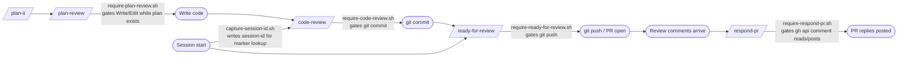

# claude-config

[](https://github.com/jcdendrite/claude-config/actions/workflows/tests.yml)
[](./LICENSE)
[](https://claude.ai/claude-code)

**Status:** stable — actively maintained.

Portable [Claude Code](https://claude.ai/claude-code) global configuration: custom skills, PreToolUse hooks that gate `git commit` and PR-comment flows, and a custom statusline. Runs on any Unix-like system (Linux, macOS, WSL). Managed with [GNU Stow](https://www.gnu.org/software/stow/).

Install it to wire in 19 pre-built hooks that gate commits, pushes, and PR comments until explicit review steps are satisfied; a full contribution pipeline from `/plan-it` through `/respond-pr`; 8 specialist reviewer agents auto-triggered from code review; and a three-tier private-project redaction system that blocks sensitive identifiers before they land in public commits. See [Philosophy](#philosophy) for the design rationale.

Maintained by [Cordova Strategy](https://cordovastrategy.com).

## Table of Contents

- [Philosophy](#philosophy)
- [Docs](#docs)
- [Quickstart](#quickstart)
- [Requirements](#requirements)
- [What this installs](#what-this-installs)
- [Configuration](#configuration)
  - [Worktree enforcement](#worktree-enforcement)
  - [Private-project redaction](#private-project-redaction)
  - [Auto mode](#auto-mode)
  - [Output preferences](#output-preferences)
  - [Machine-specific overrides](#machine-specific-overrides)
- [Context management](#context-management)
- [Tests](#tests)
- [Acknowledgments](#acknowledgments)
- [License](#license)

## Philosophy

### Why this repo exists

Working across a variety of projects from very early stage to enterprise-level, I wanted to use a flexible but predictable setup for Claude Code to help me get through large chunks of work efficiently and cost-effectively: from security audits of vibe-coded codebases to building out standard features, adding testing infrastructure, and enforcing quality against industry-standard, best-practice checklists. I wanted to stop fixing the same errors that AI agents kept encountering and really focus my time on the nuanced technical challenges that need human judgment.

### How this repo is different from others

AI agents are powerful but probabilistic. They will frequently gaslight you, or more fairly put, they will confidently draw incorrect conclusions from prose (even top-class models). Simply stated, unsupervised AI is reliable for summarization but not synthesis. I wanted to add a layer of determinism on top of agents' inherently probabilistic judgment to enforce quality and prevent repetitive errors where I could. To achieve these goals, I added safeguards in this repo with *hooks* and *markers*.

I also wanted to encode industry-standard best practices in this repo. LLMs are trained on the corpus of the internet and are biased by the loudest and most common viewpoints. While the wisdom of the masses can often be directionally correct, it's best to defer to primary sources and scientific thinking, applying the rigor of research and adhering to evidence-based approaches. You'll see those perspectives represented in the content of the *skills* and *instructions* in this repo, with *references* to primary sources that converge on tried-and-true guidelines on how to design and write good software.

### How enforcement complements instructions

Claude Code without enforcement will claim code is done before tests pass, skip the review step when it judges a change "too small," write to the main worktree when a concurrent session is already staged there, and paste project codenames directly into commit messages and PR bodies. `claude-config` makes these mistakes structurally impossible rather than relying on prompt instructions.

A CLAUDE.md instruction says "you should run code-review before committing." A PreToolUse hook says "the commit is denied until code-review ran on this exact diff in this session." This distinction is the core design choice: enforce at the tool-call boundary, not at the prompt layer, because prompt-layer instructions are advisory — the model can disregard them on any change it judges simple enough not to need review.

`claude-config` is a **workflow-enforcement layer** — hooks that gate what Claude can do until explicit review steps are satisfied. It wires in the `anthropics/claude-plugins-official` marketplace but ships official plugins disabled by default; stow users can enable any of them via `enabledPlugins` in their settings. It also disables seven bundled Claude Code skills that overlap with its review pipeline or are one-time setup utilities (see [docs/skills.md — Bundled skills disabled by default](docs/skills.md#bundled-skills-disabled-by-default)); stow users can re-enable any of them via `skillOverrides` in `~/.claude/settings.local.json`. `claude-config` ships the enforcement harness; hand-rolled `~/.claude/` configs improvise the patterns `claude-config` systematizes: per-session marker keying, specialist reviewer routing, and three-tier redaction.

## Docs

- [`docs/design-decisions.md`](docs/design-decisions.md) — nine non-obvious choices (hook-enforced gates, per-session sha256 marker keying, no shared skill partials, project-layer composition via prose-pointer + glob, reviewer persona roster operations, etc.) and the reasoning behind each.
- [`docs/walkthrough.md`](docs/walkthrough.md) — one full contribution cycle: plan → plan-review → code → code-review → commit → ready-for-review → push → respond-pr, showing each hook firing in sequence.
- **Two `CLAUDE.md` files.** The repo-root [`CLAUDE.md`](CLAUDE.md) is contributor workflow for this repo (what GitHub renders by default). The stowed [`claude/.claude/CLAUDE.md`](claude/.claude/CLAUDE.md) is the global engineering instructions applied to every Claude Code session on the machine after `./install.sh`.

### Notable patterns

The README below is organized by feature surface (hooks, skills, plugins, scripts). If you came looking for transferable ideas, these are the load-bearing ones:

- **Per-session sha256 marker keying** — review markers key on `<repo-hash>.<session-id>` plus the staged-diff sha256, so a re-staged line auto-invalidates the gate without timers or manual reset, and parallel sessions can't clear each other's markers. See [`docs/hooks.md`](docs/hooks.md) (`require-code-review.sh`) and `docs/design-decisions.md` decision 2.
- **Compaction-aware marker re-injection** — `session-marker-dashboard.sh` matches `startup|clear|compact`, restoring active-bypass marker visibility after auto-compact fires. See [Context management](#context-management).
- **Read-before-dispatch routing gate** — `require-routing-read.sh` blocks subagent spawn during `/plan-review` until `ROUTING.md` is read; a PostToolUse companion records the read per session. See [`docs/hooks.md`](docs/hooks.md).
- **Project-layer composition by glob + Skill-tool dispatch** — `/plan-it`, `/plan-review`, `/code-review`, and `/test-conventions` glob for `.claude/skills/<parent>-<project>/SKILL.md` at runtime; consuming repos extend the base skill without forking. Description-based auto-trigger was empirically tested and rejected (it doesn't fire from inside a running skill). Add-on skills on the project side should set `disable-model-invocation: true` — the parent invokes them via the Skill tool, so their description doesn't need to be in the always-loaded skill-listing budget. See [docs/skills.md](docs/skills.md) and `docs/design-decisions.md` decision 8.
- **Three-tier redaction** — always-on tracker-ID regex, opt-in user-local blocklist, reviewer discipline for structural fingerprints. See [Private-project redaction](#private-project-redaction).

## Quickstart

```bash
git clone git@github.com:jcdendrite/claude-config.git ~/claude-config
cd ~/claude-config
./install.sh
```

This symlinks `claude/.claude/` into `$HOME/.claude/`.

## Requirements

- **Operating system:** Linux, macOS, or WSL2. Native Windows (PowerShell / cmd.exe) is not supported — every hook is a bash script and `install.sh` uses GNU `stow` with symlinks. If you're on Windows, install inside [WSL](https://learn.microsoft.com/en-us/windows/wsl/install) instead.
- **Shell:** `bash`. Hooks and `install.sh` use `#!/bin/bash`.
- **Tools:** `stow`, `git`, `gh`, `jq`, `sha256sum`, and the `claude` CLI. `install.sh` verifies they exist and exits early if any are missing.
- **Optional:** `pytest` for running the test suite (`pytest claude/.claude/`).

**macOS:** `sha256sum` ships in GNU `coreutils`. Install with `brew install coreutils`, then add the gnubin directory to PATH so the unprefixed name resolves: `export PATH="$(brew --prefix coreutils)/libexec/gnubin:$PATH"`.

**PATH setup for script wrappers:** The user-facing scripts are installed as wrappers under `~/.local/bin/`. That directory needs to be on your PATH:

- **Linux / WSL2 (Ubuntu-based):** `~/.profile` auto-adds `~/.local/bin` if the directory exists. Re-login, or pick it up immediately: `source ~/.profile`
- **macOS (stock zsh):** not auto-added. Add once: `echo 'export PATH="$HOME/.local/bin:$PATH"' >> ~/.zshrc && source ~/.zshrc`
- **fish (any platform):** `fish_add_path ~/.local/bin`

Verify: `command -v cleanup-merged-branches` should print the wrapper path.

**Existing users:** `git pull` does not materialize new wrappers automatically — re-run `./install.sh` once after pulling. After re-stowing, run `git status` in the repo: if any file under `claude/.local/bin/` shows as modified, stow's `--adopt` flag adopted a same-named local file. Revert with `git checkout claude/.local/bin/<name>` and rename the conflicting local script.

## What this installs

```
claude/        # stow package — claude/.claude/ → ~/.claude/
plugins/       # marketplace plugins (lovable-cloud, skill-review, claude-hook-review)
docs/          # design-decisions, walkthrough, hooks, skills, scripts, auto-mode, redaction
.github/       # workflows, dependabot
.claude/       # repo-local plans, settings, worktrees (gitignored)
```

### Workflow

The skills form a sequential pipeline that covers the full contribution lifecycle. Hooks enforce the transitions so steps cannot be skipped.

Linear pipeline: plan-it → plan-review → code → code-review → commit → ready-for-review → push → respond-pr; each transition gated by a require-\* hook.



**Skills in the pipeline:**

- **`/plan-it`** — produce the implementation plan.
- **`/plan-review`** — review the plan against domain checklists.
- **`/code-review`** — principal-engineer review with ripple-effect triage.
- **`/skill-review`** — behavioral-equivalence audit when a `SKILL.md` changes. (Provided by the `skill-review@claude-config` plugin — see [Project-scoped plugins](docs/skills.md#project-scoped-plugins).)
- **`/ready-for-review`** — final tests + cumulative-diff review before push.
- **`/respond-pr`** — fetch and reply to all PR comments with `[Claude Code]` attribution.

**Hook transitions:**

| Hook | Gates | Cleared by |
|---|---|---|
| `require-plan-review.sh` | `Write`/`Edit` while an uncommitted or modified plan file exists in `.claude/plans/` | `/plan-review` per-session marker |
| `require-code-review.sh` | `git commit` | `/code-review` run against current staged state |
| `require-skill-review.sh` | `git commit` when staged changes include a `SKILL.md` | `/skill-review` behavioral-equivalence audit (ships with `skill-review@claude-config` plugin) |
| `deny-private-project-refs.sh` | `git commit`, `gh pr create`, `gh pr edit`, mutating `gh api` | Clean the flagged tracker ID or private-project name from the diff/PR body |
| `deny-pii-in-commits.sh` | `git commit` when PII/PHI is in the staged diff or commit message (opt-in) | Remove the flagged content, or `exclude:` a synthetic-fixture path |
| `deny-data-file-reads.sh` | `Read` of a data-shaped file (opt-in) | No clear — inspect data files outside Claude |
| `require-ready-for-review.sh` | `git push`, `gh pr ready` | `/ready-for-review` run since last commit |
| `require-respond-pr.sh` | `gh api` PR comment reads/posts | `/respond-pr` active bypass marker |
| `capture-session-id.sh` | — (SessionStart, no gate) | Writes session-id so marker filenames are per-session |

See [`docs/walkthrough.md`](docs/walkthrough.md) for a concrete example of one full contribution cycle with hooks firing. For full descriptions of all hooks, skills, scripts, and project-scoped plugins, see [`docs/hooks.md`](docs/hooks.md), [`docs/skills.md`](docs/skills.md), and [`docs/scripts.md`](docs/scripts.md).

### Statusline

```
Opus 4.7 [###-------] 32% • 5h:7% • 7d:24% • $1.24 • ~/MyCode/proj • (main)
```

`statusline-command.sh` renders model, context usage percentage, 5-hour and 7-day capacity used percentages (for subscription plans), session cost (for API-based plans), working directory, and git branch in the status bar. Configured in `settings.json` via the `statusline` key.

### Plugins (marketplace)

Skills that apply to one or a few private projects — not broadly to all sessions — live as marketplace plugins under `plugins/<name>/` rather than in `claude/.claude/skills/`. This keeps them out of the global skill catalog and lets them be installed only in the repos that need them.

This repo exposes a marketplace via `.claude-plugin/marketplace.json`. Each plugin lives under `plugins/<name>/` with a `.claude-plugin/plugin.json` manifest and skills under `plugins/<name>/skills/<name>/SKILL.md`.

**Current plugins:**

`./install.sh` registers the `claude-config` marketplace automatically. To register it manually (without running `install.sh`), run `claude plugin marketplace add <path-to-claude-config>`. Then install any of the plugins below at project scope:

- **`lovable-cloud`** — Skills for Lovable Cloud projects: Project/Workspace Knowledge fields, edge-function auth model (ES256 gateway constraint, two-tier auth), and migration-sync workflow. `claude plugin install lovable-cloud@claude-config --scope project`
- **`skill-review`** — Behavioral-equivalence audit for `SKILL.md` changes; gates `git commit` when staged changes include a `SKILL.md`. `claude plugin install skill-review@claude-config --scope project`
- **`claude-hook-review`** — Review playbook for `.claude/hooks/*.sh` and `settings.json` hook entries: event/matcher selection, path resolution, script skeleton, fail-open/fail-closed posture, dispatch drift, and the 9-item review checklist. `claude plugin install claude-hook-review@claude-config --scope project`

### Agents

Three agent types ship in `claude/.claude/agents/`:

**Reviewer subagents** — eight stack-agnostic personas spawned by `/plan-review` and `/code-review` based on the **Item ownership** tables in those skills. Each runs in its own context with read-only tools (`Read`, `Grep`, `Glob`, `Bash`).

- **`ciso-reviewer`** — threat modeling, auth boundaries, privilege escalation, data exposure, defense in depth.
- **`staff-backend-engineer`** — API contracts, error handling, idempotency, retry semantics, service boundaries; AND application data-store schema design (relational + NoSQL): partition keys, GSI/LSI, document shape, single-table vs multi-table, index coverage for app queries.
- **`staff-frontend-engineer`** — components, state, data fetching, cache consistency, routing, forms, accessibility, Web Vitals, i18n, client-side analytics emission.
- **`staff-data-engineer`** — operational data infrastructure across all stores: migration pipeline impact, DDL execution shape, CDC / change-stream config, ETL/ELT pipelines, warehouse ingestion transport, schema-drift detection, catalog / lineage tracking.
- **`staff-analytics-engineer`** — warehouse-side modeling (fact/dim, SCD, partitioning, materialization), transformation correctness, source-schema review for ELT-readiness from a data-contract consumer perspective.
- **`staff-platform-engineer`** — CI/CD, IaC, shell, deployment ordering, secret provisioning; observability coverage, alerting, SLO impact, runbook linkage, load, cost; deploy-window ordering and lock-budget on migrations.
- **`staff-product-engineer`** — spec-to-user-problem fidelity, critical spec reading, telemetry semantics, adjacent-regression, backward compat, accessibility-as-spec-fidelity.
- **`staff-sdet`** — testability of the design, pyramid shape, edge cases, mock design, fixture realism, security-invariant coverage, production code that lacks tests.

Schema-change diffs nominally route three ways — `staff-backend-engineer` (designs), `staff-data-engineer` (operational / pipeline impact, DDL shape), `staff-analytics-engineer` (ELT-readiness). Trigger discipline in the skill bodies prevents three-persona fire on trivial additive changes. The decision criteria for adding, splitting, or excluding a persona — including why DBRE, data platform engineer, and data steward are deliberately not in the roster — are in [Designing reviewer personas](#designing-reviewer-personas) below.

For guidance on extending, splitting, or spawning personas, see [design-decisions.md §9](docs/design-decisions.md).

**`check-runner`** — a non-reviewer Haiku agent that runs test suites and returns structured pass/fail verdicts. Dispatched by the parent via the `Agent` tool; see `claude/.claude/CLAUDE.md` "Heavy command output". Constrained to `tools: Bash` only, capped at `maxTurns: 20`, and guarded by a `hooks.PreToolUse` script that denies git write operations — see `docs/design-decisions.md` §10.

**`code-writer`** — a non-reviewer Sonnet agent that implements delegated code changes and self-reviews its own diff before returning, verifying it against the relevant `staff-*` reviewer angles so review-finding-class defects are caught in its own context rather than as a parent round-trip. Dispatched by the parent in place of `general-purpose` for code-writing; see `claude/.claude/CLAUDE.md` "Model Routing" and `docs/design-decisions.md` §14.

### Configuration files

- **`CLAUDE.md`** — baseline engineering instructions (judgment heuristics, working style, safety rules).
- **`settings.json`** — global settings wiring up the hooks, statusline, and a `permissions.deny` hard floor for `sudo` and secret-file reads (see [Auto mode](#auto-mode)). Configured with **opusplan** as the default model (cost-effective and [recommended by Anthropic](https://support.claude.com/en/articles/14552983-models-usage-and-limits-in-claude-code)). Session-only overrides (model, effortLevel) are intentionally not tracked — use the `ANTHROPIC_MODEL` and `CLAUDE_CODE_EFFORT_LEVEL` env vars, or `/effort max` mid-session.

### Scripts

Utility scripts in `claude/.claude/scripts/` (stowed to `~/.claude/scripts/`); user-facing ones are installed as wrappers under `~/.local/bin/`. For full descriptions of every script, see [`docs/scripts.md`](docs/scripts.md).

## Configuration

Configuration options spanning machine-local, project-local, and user-local settings. See [SECURITY.md](./SECURITY.md) for the threat model — what the hook system protects against and what it doesn't.

### Worktree enforcement

`require-worktree-for-git-writes.sh` denies non-read-only git operations (`commit`, `push`, `rebase`, `reset`, `merge`, `checkout`, etc.) unless the session runs inside a linked git worktree. Read-only commands (`status`, `log`, `diff`, `fetch`, `show`, `blame`, etc.) are always allowed. The hook is opt-in per repo via a committed sentinel file.

The race it prevents: concurrent Claude Code sessions sharing a working tree can step on each other — one session's `git reset --hard`, `git stash`, or `git checkout` silently wipes another session's uncommitted edits. See [Claude Code issue #34327](https://github.com/anthropics/claude-code/issues/34327) for examples of this failure mode in the wild.

#### Activating enforcement on a repo

The sentinel coexists with any existing `.claude/` content — `mkdir -p` is a no-op if the directory is already there, and the sentinel is an inert marker file alongside whatever project-level plans, `settings.local.json`, or untracked worktree dirs the repo already holds.

```bash
cd path/to/your/repo

mkdir -p .claude
cat > .claude/worktree-required <<'EOF'
# Claude Code worktree enforcement marker.
# Presence of this file activates ~/.claude/hooks/require-worktree-for-git-writes.sh.
# See https://github.com/jcdendrite/claude-config for details.
EOF

grep -qxF '.claude/worktrees/' .gitignore 2>/dev/null || echo '.claude/worktrees/' >> .gitignore

git add .claude/worktree-required .gitignore
git commit -m "Activate Claude Code worktree enforcement"
```

#### Working inside a worktree

A [git worktree](https://git-scm.com/docs/git-worktree) is a linked working directory on a separate branch that shares the repo's `.git` object storage with the main clone. `git worktree add <path> -b <branch>` creates one; multiple worktrees of the same repo can have different branches checked out simultaneously, which is what lets concurrent Claude Code sessions stay isolated.

With enforcement active, start sessions for non-trivial work in a worktree instead of the main tree:

```bash
git worktree add .claude/worktrees/my-feature -b my-feature
cd .claude/worktrees/my-feature
# work happens here; git commit/push/etc. pass through the hook cleanly
```

Agents spawned with `isolation: worktree` create their own worktrees under `.claude/worktrees/` automatically — on a harness-generated branch name (`worktree-agent-<hash>`). That auto-naming is fine for ephemeral, non-PR work (parallel exploration, reviewer agents). For PR-bound work that needs a meaningful branch name, create the worktree yourself with `git worktree add .claude/worktrees/<slug> -b <slug>` first, then dispatch the agent into that path.

To opt out, delete `.claude/worktree-required`.

### Private-project redaction

This repo is public — any project codename, organization name, or tracker-ID that lands in a commit or PR description ships to the world. `claude-config` defends against that in three tiers:

1. **Tracker-ID scan** (always on, no setup) — `deny-private-project-refs.sh` blocks `git commit`, `gh pr create`, `gh pr edit`, and mutating `gh api` calls whose content carries `[A-Z]{2,}-\d+` tracker tokens outside an OSS-prefix allowlist.
2. **Private-projects blocklist** (opt-in) — the same hook reads a user-local `~/.claude/private-projects.md` and blocks any commit or PR whose content matches a listed project name (case-insensitive, whole-word).
3. **Reviewer discipline** — structural fingerprints the hook can't catch (a verbatim RLS policy, a rare column-naming pattern) are a review responsibility, not a mechanical one.

The repo-root [`CLAUDE.md`](./CLAUDE.md) "Redact private-project-identifying content" rule defines *what* to keep out; the hook is the mechanical enforcement of tiers 1–2. For blocklist setup, file format, match semantics, the deny-message contract, and the fork-contributor path, see [`docs/private-project-redaction.md`](docs/private-project-redaction.md).

### Auto mode

[Auto mode](https://code.claude.com/docs/en/permission-modes) replaces per-action permission prompts with a background classifier that evaluates each tool call before it runs, blocking anything irreversible, destructive, or targeted outside your environment. This repo adds two things on top of the stock feature:

- **`claude-auto` wrapper** — resolves a model-eligibility mismatch. This repo defaults to `opusplan`, which routes auto mode's execution to Sonnet, but Sonnet is not auto-mode-eligible on Max. The wrapper starts a session directly in auto mode on an eligible model.
- **Hard-floor `permissions.deny` rules** — `settings.json` ships deny rules that run *before* the classifier and cannot be overridden by any `autoMode.allow` entry, hard-blocking `sudo` and well-known secret-file reads. These apply in every permission mode, not just auto mode.

For plan and model requirements, activation, the full hard-floor deny table, the `settings.local.json` `autoMode.environment` schema, and tuning commands, see [`docs/auto-mode.md`](docs/auto-mode.md).

### Output preferences

To customize response tone, formatting, and communication style, create `~/.claude/output-preferences.md`. This file is user-local and never committed to this repo. It is loaded via an instruction in `claude/.claude/CLAUDE.md`'s "Output Preferences" section.

**Cap:** keep it under 50 lines — content beyond that competes with project context for the 200-line CLAUDE.md budget. Avoid duplicating rules already in the global CLAUDE.md — they apply regardless, and duplicate entries waste context budget.

**Template:**

```markdown
# Output preferences

- Tone: direct and calibrated — state things plainly; match certainty to evidence (no overclaiming, no hedging filler).
- Length: concise. Include the why when non-obvious; skip narration of internal process.
- Avoid emoji unless explicitly asked.
- Prefer plain prose over bullet lists when the answer is a single concept.
```

### Machine-specific overrides

Machine-local Claude Code permissions belong in `~/.claude/settings.local.json` (not tracked).

## Context management

Claude Code compresses conversation history when the context window fills up. This config adds two layers to keep that process reliable.

### How it works

1. **Marker re-injection (automatic).** `session-marker-dashboard.sh` is registered with matcher `startup|clear|compact`, so it fires on session start, after `/clear`, and after compaction. It emits `hookSpecificOutput.additionalContext` with the current state of all active review-skill gate markers, restoring marker knowledge in the resumed context automatically. You don't need to do anything for this to work.

2. **`/handoff` slash command (user-invoked).** When the task will continue in a fresh session, run `/handoff` to write a structured resume file at `/tmp/<slug>-handoff.md`. The §1–§7 shape is defined inline in `claude/.claude/skills/handoff/SKILL.md`. Claude proactively suggests `/handoff` at ~60% context usage because cleaner context produces a higher-quality resume file, and every turn beyond 60% is waste.

### When to use which

| Situation | Right action |
|---|---|
| Switching to an unrelated task | `/clear` (intent-driven, no percentage threshold) |
| Ending a session, will resume later | `/handoff` (produces resume file) |
| Context >83.5%: auto-compact fires | Happens automatically; marker state is restored by the hook |

### Threshold reference

- ~60%: suggested threshold for `/handoff` — [Anthropic best practices](https://code.claude.com/docs/en/best-practices) cite 60% as the point where context compression produces the highest-quality summary; the same logic applies to `/handoff` (less context noise → better resume file).
- ~83.5%: auto-compact trigger (community-reported; configurable via `CLAUDE_AUTOCOMPACT_PCT_OVERRIDE`).
- Run `analyze-context` to inspect token usage for the current session.


## Tests

Pytest suite covering hooks (allow, deny, and ask paths) and skill description contracts:

```bash
pytest claude/.claude/
```

CI runs this on every PR and main push via `.github/workflows/tests.yml`.

## Acknowledgments

Heavy reliance on official Anthropic documentation throughout: [Claude Code docs](https://code.claude.com/docs/en/), [permission modes reference](https://code.claude.com/docs/en/permission-modes), [auto-mode engineering deep dive](https://www.anthropic.com/engineering/claude-code-auto-mode), [skill best practices](https://code.claude.com/docs/en/skill-best-practices), and [Claude Code best practices](https://code.claude.com/docs/en/best-practices). Stow distribution pattern inspired by the GNU Stow community.

Bug reports and feature requests: [GitHub Issues](https://github.com/jcdendrite/claude-config/issues). Security disclosures: see [SECURITY.md](./SECURITY.md).

## License

Released under the MIT License — see [LICENSE](./LICENSE).
